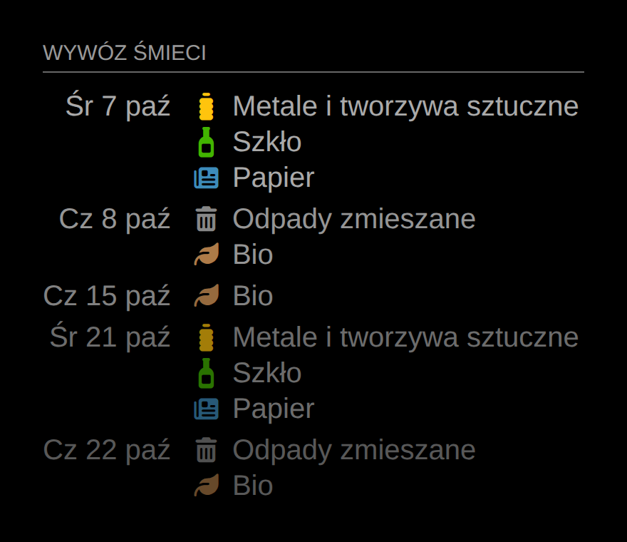

# MMM-EcoHarmonogram

[](https://github.com/arekp/MMM-EcoHarmonogram/actions/workflows/ci.yml)
[](LICENSE)

Moduł [MagicMirror²](https://magicmirror.builders) pokazujący najbliższe terminy wywozu odpadów
z [EcoHarmonogramu](https://ecoharmonogram.pl), dla dowolnego adresu z gmin, które z niego korzystają.

*English: a MagicMirror² module that shows upcoming waste collection dates for any address covered by
EcoHarmonogram, the schedule service used by many Polish municipalities. See [English summary](#english-summary).*



## Funkcje

- Dowolny adres: miejscowość, gmina, ulica, numer domu (także warianty zabudowy, rejony i grupy).
- Wywozy pogrupowane po dniach, „Dziś” i „Jutro” wyróżnione.
- Ikony dla rodzajów odpadów i kolory z EcoHarmonogramu.
- Automatyczne przejście na nowy harmonogram (np. na kolejny rok), gdy gmina go opublikuje.
- Czytelne komunikaty błędów konfiguracji z listą dostępnych wartości.
- Bez zależności npm w czasie działania.

## Instalacja

```bash
cd ~/MagicMirror/modules
git clone https://github.com/arekp/MMM-EcoHarmonogram.git
```

Wymagany Node.js 20 lub nowszy. Moduł nie ma zależności, więc `npm install` nie jest potrzebny.

Aktualizacja:

```bash
cd ~/MagicMirror/modules/MMM-EcoHarmonogram && git pull
```

## Konfiguracja

### 1. Znajdź swój adres

Najprościej użyć dołączonego skryptu. Sprawdza on adres w EcoHarmonogramie, podpowiada brakujące
opcje i drukuje gotowy fragment konfiguracji:

```bash
cd ~/MagicMirror/modules/MMM-EcoHarmonogram
npm run find -- --town "Pruszków" --district "Pruszków" --street "Rolnicza" --number 18
```

```
Adres znaleziony. Najbliższe wywozy:
  2026-10-07  METALE I TWORZYWA SZTUCZNE
  2026-10-07  PAPIER
  ...
Fragment do config/config.js:
{
	module: "MMM-EcoHarmonogram",
	...
```

Jeśli brakuje jakiejś opcji (np. gminy albo wariantu zabudowy), skrypt wypisze dostępne wartości.
Sama nazwa miejscowości (`npm run find -- --town "Pruszków"`) pokaże pasujące miejscowości i gminy.

### 2. Dodaj moduł do `config/config.js`

```js
{
	module: "MMM-EcoHarmonogram",
	position: "top_left",
	header: "Wywóz śmieci",
	config: {
		town: "Pruszków",
		district: "Pruszków",
		street: "Rolnicza",
		number: "18",
		maxDays: 3 // opcjonalnie: ile najbliższych dni z wywozem pokazać (domyślnie 1)
	}
},
```

### Opcje adresu

| Opcja | Wymagana | Opis |
|-|-|-|
| `town` | tak | Miejscowość, np. `"Pruszków"` |
| `number` | tak | Numer domu, np. `"18"` lub `"317E"` |
| `street` | zwykle | Ulica. Dla wsi bez ulic zostaw puste |
| `district` | gdy trzeba | Gmina, gdy kilka miejscowości ma tę samą nazwę |
| `sides` | gdy trzeba | Wariant harmonogramu, np. `"Zabudowa jednorodzinna"` |
| `region` | gdy trzeba | Rejon w obrębie miejscowości, np. `"Nowy Ramiszów"` |
| `groups` | gdy trzeba | Wybór grup, np. `{ g1: "Zabudowa jednorodzinna", g2: "Papier (1 x miesiąc)" }` |
| `community` | rzadko | Identyfikator gminy w EcoHarmonogramie (gdy wyszukiwanie po nazwie nie wystarcza) |
| `app` | rzadko | Własna aplikacja gminy w EcoHarmonogramie, np. `"gdansk"`, `"opole"`, `"slupsk"`, `"eco-przyszlosc"` |
| `language` | nie | Język nazw odpadów i dat: `"pl"` (domyślnie), `"en"`, `"uk"`, `"ru"` |

Opcje „gdy trzeba” wypełniasz tylko, jeśli moduł (albo `npm run find`) zgłosi, że są potrzebne.

### Opcje wyglądu

| Opcja | Domyślnie | Opis |
|-|-|-|
| `maxDays` | `1` | Ile najbliższych dni z wywozem pokazać. Domyślnie tylko najbliższy dzień (ze wszystkimi odbieranymi wtedy odpadami); np. `5` pokaże pięć kolejnych terminów |
| `daysAhead` | `45` | Jak daleko w przód szukać wywozów |
| `exclude` | `["TERMIN PŁATNOŚCI"]` | Pozycje harmonogramu do pominięcia (wielkość liter bez znaczenia) |
| `dateFormat` | `"dd D MMM"` | Format dat dalszych niż jutro ([moment.js](https://momentjs.com/docs/#/displaying/format/)) |
| `fade` | `true` | Dalsze terminy stopniowo bledną |
| `useColors` | `true` | Kolory ikon z EcoHarmonogramu (zbyt ciemne są rozjaśniane) |
| `showIcons` | `true` | Ikony rodzajów odpadów; `false` pokazuje kolorowe kropki |
| `icons` | patrz niżej | Mapa: fragment nazwy odpadu → ikona [Font Awesome](https://fontawesome.com/search?ic=free&o=r) |
| `defaultIcon` | `"fa-recycle"` | Ikona dla nierozpoznanych rodzajów odpadów |
| `updateInterval` | `21600000` (6 h) | Co ile milisekund pobierać dane. Po błędzie sieci ponowienie po 15 min |
| `animationSpeed` | `1000` | Czas animacji odświeżenia widoku (ms) |

Domyślne ikony:

| Fragment nazwy | Ikona |
|-|-|
| `zmieszane` | `fa-trash-can` |
| `bio` | `fa-leaf` |
| `metal`, `tworzyw` | `fa-bottle-water` |
| `szkło` | `fa-wine-bottle` |
| `papier` | `fa-newspaper` |
| `gabaryt` | `fa-couch` |
| `elektro` | `fa-plug` |
| `popiół` | `fa-fire` |
| `choink` | `fa-tree` |
| `zielon` | `fa-seedling` |
| `płatno` | `fa-money-bill` |

Własne ikony dopisujesz do mapy, pozostałe zostają, np. `icons: { bio: "fa-apple-whole", gruz: "fa-trowel-bricks" }`.

## Źródło danych

Moduł korzysta z publicznego, choć nieudokumentowanego API `https://ecoharmonogram.pl/api/api.php`,
z którego korzysta aplikacja mobilna EcoHarmonogram. Kolejność wywołań to
`getTowns` → `getSchedulePeriods` → `getStreets` → `getSchedules`. Dopasowanie adresu
(grupy, warianty, rejony, zakresy numerów) jest wzorowane na źródle `ecoharmonogram_pl` z projektu
[hacs_waste_collection_schedule](https://github.com/mampfes/hacs_waste_collection_schedule) dla Home Assistanta.

API może się zmienić bez zapowiedzi. Jeśli moduł przestanie działać, zgłoś to w [Issues](https://github.com/arekp/MMM-EcoHarmonogram/issues).

## Rozwiązywanie problemów

- **„Nie znaleziono miejscowości”** – sprawdź na [ecoharmonogram.pl](https://ecoharmonogram.pl), czy Twoja gmina korzysta z EcoHarmonogramu. Jeśli gmina ma własną aplikację, ustaw `app`.
- **„Dostępne wartości …”** – skopiuj jedną z podanych wartości do wskazanej opcji.
- **Brak danych na lustrze** – sprawdź logi MagicMirror (`pm2 logs` lub konsolę), komunikaty modułu zaczynają się od `MMM-EcoHarmonogram:`.

## Rozwój

```bash
npm install       # narzędzia deweloperskie (ESLint, jsdom)
npm run lint
npm test          # testy offline na zapisanych odpowiedziach API
```

Struktura:

```
MMM-EcoHarmonogram.js   widok modułu (przeglądarka)
node_helper.js          pobieranie danych i harmonogram odświeżania (Node)
lib/ecoharmonogram.js   klient API EcoHarmonogram i dopasowanie adresu
scripts/find-address.js pomocnik konfiguracji (npm run find)
translations/           pl, en, uk
test/                   testy node:test
```

Zmiany opisuje [CHANGELOG.md](CHANGELOG.md).

## English summary

MMM-EcoHarmonogram displays the next waste collection days for any address served by
[EcoHarmonogram](https://ecoharmonogram.pl). Clone it into `~/MagicMirror/modules`, run
`npm run find -- --town "<town>" --street "<street>" --number <no>` to validate the address and get a ready
config snippet, then add it to `config/config.js` as shown above. All options are listed in the tables
above (`town`, `district`, `street`, `number`, `sides`, `region`, `groups`, `community`, `app`, `language`
for the address; `maxDays`, `daysAhead`, `exclude`, `showIcons`, `icons`, … for the display).
Translations: Polish, English, Ukrainian.

## Licencja

[MIT](LICENSE)
